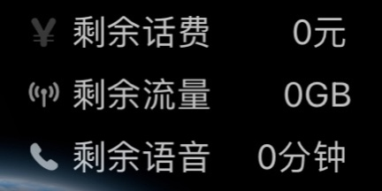

> [Download link](https://xteko.com/redir?url=https://github.com/wuhuhuuuu/study/raw/main/JSBox/10099.box)

# 中国广电 小组件

<table>
  <tr>
    <td>
      
    </td>
    <td>
      
    </td>
  </tr>
</table>

## 如何配置

* 配置 BoxJs 及添加订阅
  * [BoxJs 教程](https://docs.boxjs.app)
  * 添加订阅
    * [一键添加](http://boxjs.com/#/sub/add/https://github.com/wuhuhuuuu/study/raw/main/Scripts/wuhuhuuuu.boxjs.json)
    * [手动添加](https://github.com/wuhuhuuuu/study/raw/main/Scripts/wuhuhuuuu.boxjs.json)

* [获取Cookie](https://github.com/wuhuhuuuu/study/tree/main/Scripts/10099)

> wuhuhuuuu